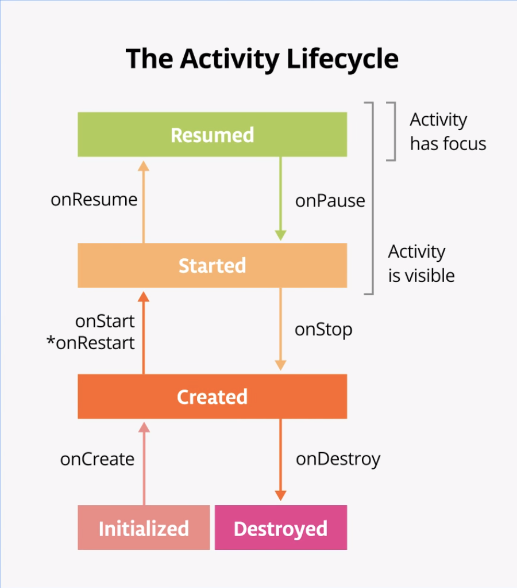
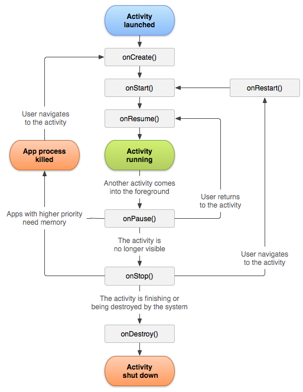

# Життєвий цикл Activity (Activity Lifecycle)

Кожен екран у вашому застосунку (Activity) проходить через певну послідовність станів — від моменту створення до моменту повного знищення. Ця послідовність називається **Життєвим циклом (Lifecycle)**.

Розуміння життєвого циклу є критично важливим. Якщо ви не будете враховувати ці стани, ваш застосунок може:
* Втрачати дані, коли користувач перевертає екран (зміна орієнтації).
* Продовжувати програвати відео або витрачати батарею у фоновому режимі, коли програма згорнута.
* Зазнавати краху (crash), коли користувач повертається до застосунку після довгої паузи.

## Основні стани Activity

З точки зору архітектури Android (через клас `Lifecycle.State`), Activity може перебувати в одному з п'яти станів: **INITIALIZED**, **CREATED**, **STARTED**, **RESUMED**, та **DESTROYED**. 

## Концепції життєвого циклу Activity

Щоб керувати переходами між етапами життєвого циклу, клас `Activity` надає базовий набір колбеків (callbacks), серед яких виділяють шість основних: `onCreate`, `onStart`, `onResume`, `onPause`, `onStop` та `onDestroy`. Система викликає кожен із цих колбеків, коли Activity переходить у новий стан.

Колбеки — це методи, які спрацьовують *в момент переходу* між станами. Ось 6 основних методів життєвого циклу у порядку їх виклику при стандартному запуску:

### 1. `onCreate()`
* **Коли викликається:** Одразу після створення об'єкта Activity. Викликається лише один раз за весь час життя цього екземпляра.
* **Стан Lifecycle:** Після завершення цього методу Activity переходить у стан **CREATED**.
* **Що тут робити:** Це місце для базової ініціалізації. Тут ви викликаєте `setContentView()` (або прив'язуєте ViewBinding), щоб показати інтерфейс, ініціалізуєте ViewModel, та встановлюєте слухачі натискань (click listeners) для кнопок.
* **Що далі:** Після `onCreate()` система відразу викликає `onStart()`.

### 2. `onStart()`
* **Коли викликається:** Коли Activity стає **видимою** для користувача.
* **Стан Lifecycle:** Після завершення цього методу Activity переходить у стан **STARTED**.
* **Що тут робити:** На цьому етапі екран вже намальований, але користувач ще **не може** з ним взаємодіяти (натискати кнопки). Тут зазвичай починають оновлювати UI (наприклад, підписуються на зміни даних з бази).
* **Що далі:** Зазвичай після нього йде `onResume()`. Але якщо користувач в цей момент натисне "Назад", може викликатись `onStop()`.

### 3. `onResume()`
* **Коли викликається:** Коли Activity виходить на **передній план (Foreground)** і повністю готова до взаємодії з користувачем. 
* **Стан Lifecycle:** Після цього методу Activity переходить у стан **RESUMED**.
* **Що тут робити:** Це "найвищий" стан. Вважається, що саме в `onResume` Activity **отримує фокус** вводу від користувача. Тут програма працює нормально: можна запускати анімації, вмикати камеру, отримувати дані з сенсорів.
* **Що далі:** Activity залишається в цьому стані, поки щось не відбере фокус (наприклад, телефонний дзвінок або перехід на інший екран). Якщо це стається, викликається `onPause()`.

---
*(У цей момент користувач активно користується вашим екраном)*
---

### 4. `onPause()`
* **Коли викликається:** Коли Activity **втрачає фокус**. 
* **Стан Lifecycle:** Після виконання цього методу Activity повертається назад у стан **STARTED** (бо вона ще може бути частково видимою).
* **Що тут робити:** Наприклад: поверх вашого екрану з'явилося системне діалогове вікно, або екран поділено навпіл (Multi-window mode). *(Примітка щодо Split-Screen: починаючи з Android 10, обидві видимі Activity у спліт-скріні перебувають у стані `RESUMED`, але в старіших версіях Android одна з них обов'язково була в `PAUSED`, незважаючи на те, що користувач її бачив).* Тут потрібно ставити на паузу все, що не повинно працювати, коли користувач не дивиться прямо на екран активно (наприклад, зупинити відтворення відео або паузити гру). **Не виконуйте тут важких операцій** (як збереження в БД), бо наступна Activity не почне завантажуватися, поки `onPause()` не завершить роботу.

### 5. `onStop()`
* **Коли викликається:** Коли Activity стає **повністю невидимою**. Наприклад, користувач натиснув кнопку Home (згорнув застосунок) або перейшов на іншу `SecondActivity`.
* **Стан Lifecycle:** Після виконання цього методу Activity повертається у стан **CREATED**.
* **Що тут робити:** Це ідеальне місце для збереження даних користувача (драфту повідомлення), зупинки постійних запитів до мережі чи відписки від прослуховування локації. 
* **Що далі:** З цього стану є три шляхи:
  1. Користувач повертається до застосунку — викликається `onRestart()`, потім `onStart()`.
  2. Activity закривається назавжди — викликається `onDestroy()`.
  3. Системі не вистачає пам'яті — вона просто вбиває процес (колбеки більше не викликаються!).

### 6. `onDestroy()`
* **Коли викликається:** Перед тим, як об'єкт Activity буде назавжди знищено. Це стається, коли користувач "змахує" програму зі списку недавніх, або якщо ви самі викликали метод `finish()` в коді, або якщо система перестворює екран через поворот пристрою.
* **Стан Lifecycle:** Після виконання цього методу Activity переходить у фінальний стан **DESTROYED**.
* **Що тут робити:** Тут ви повинні звільнити всі ресурси, які могли залишитися (закрити підключення, скасувати фонові потоки), щоб уникнути витоків пам'яті (Memory Leaks).

## Найважливіші сценарії (Що відбувається під капотом?)

### Сценарій 1: Поворот екрану (Configuration Change)
Коли ви перевертаєте телефон, Android **повністю знищує** поточну Activity і створює її заново під нову орієнтацію (щоб підвантажити правильні ресурси екрану, наприклад `layout-land`).
**Ланцюжок:** `onPause` -> `onStop` -> `onDestroy` -> `onCreate` -> `onStart` -> `onResume`.
Саме тому, якщо ви зберігали якісь дані у звичайних змінних Activity, після повороту вони зникнуть (зануляться).

### Сценарій 2: Перехід на SecondActivity
Ви натискаєте кнопку "Відкрити новий екран".
**Ланцюжок:** 
1. Поточна Activity викликає `onPause()`.
2. Нова (SecondActivity) створюється і стартує: `onCreate` -> `onStart` -> `onResume`.
3. І тільки коли нова Activity повністю перекрила екран, перша викликає `onStop()`.

## Підсумок
* **`onCreate`** / **`onDestroy`** — створення та знищення (відбуваються 1 раз).
* **`onStart`** / **`onStop`** — видимість екрану (можуть відбуватися багато разів, коли користувач згортає/розгортає програму).
* **`onResume`** / **`onPause`** — фокус (можливість взаємодії). 

Не запам'ятовуйте їх напам'ять. Натомість, спробуйте додати логування (Log.d) у кожен з цих методів і поспостерігайте в Logcat, як вони викликаються при різних діях з телефоном!