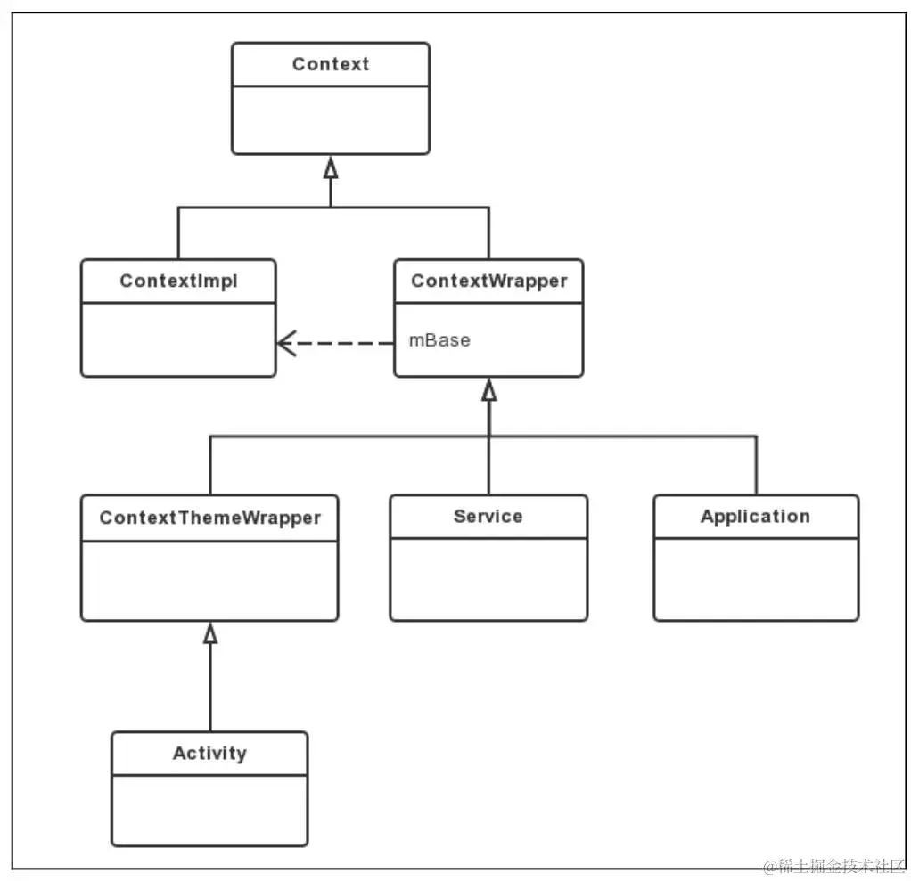

# Що таке Context в Android?

Під час розробки Android-застосунків ви постійно зустрічаєте слово **`Context`** (або передаєте `this`, `context`, `applicationContext` у різні методи). 

`Context` — це один із найважливіших, але водночас один із найбільш незрозумілих концептів для початківців. Розуміння того, як працює `Context`, необхідне для написання стабільного коду та запобігання витокам пам'яті (Memory Leaks).

## 1. Що таке Context?

Метафорично `Context` — це **"паспорт доступу"** або **"міст"** між вашим кодом та операційною системою Android. 

Оскільки Android-застосунок працює у строгій "пісочниці" (Sandbox), ваш код не може просто так взяти й отримати доступ до системних функцій чи файлів. Для будь-якої взаємодії з системою вам потрібен `Context`.

Через `Context` ви можете:
* **Завантажувати ресурси:** доступ до рядків (`R.string`), зображень (`R.drawable`), кольорів.
* **Керувати екранами та UI:** відкривати нові екрани (`startActivity`), створювати View, показувати діалогові вікна чи Toast.
* **Отримувати доступ до системних сервісів:** вібрація, Wi-Fi, геолокація, будильник, менеджер сповіщень.
* **Працювати з файловою системою:** доступ до внутрішньої папки застосунку, бази даних SQLite/Room, SharedPreferences.

### 💡 Аналогія з реального життя

**Уявіть великий готель:**
Ви — гість, який проживає в номері. Якщо вам потрібно замовити їжу в номер, отримати ключ від басейну чи закликати таксі, ви не йдете самостійно шукати шеф-кухаря на кухні і не лізете у службові приміщення. Ви просто телефонуєте на **Рецепцію (до Консьєржа)**. 

Рецепція перевіряє, у якому номері ви живете, чи маєте ви доступ до цієї послуги, і сама зв'язується з відповідними службами готелю, щоб виконати ваше прохання.

**А тепер перенесемо це в Android:**
* **Гість у номері** — це ваші `Activity`, `Service` чи `Application` (ваш код).
* **Сам готель із його ресурсами** — це **Операційна система Android** (яка володіє камерою, екраном, файловою системою, вібрацією та сповіщеннями).
* **Рецепція (Консьєрж)** — це **`Context`**.

Ваша `Activity` не може напряму увімкнути вібрацію на пристрої чи зчитати файл із диска. Вона звертається до `Context` (Рецепції), а той перевіряє дозволи та замовляє необхідну дію в операційної системи Android.

---

## 2. Ієрархія класів Context

У розробників-початківців часто виникає запитання: *"Якщо Context — це інструмент для зв'язку з системою, чому у коді ми передаємо саму Activity (через `this`) там, де вимагається Context?"*

Відповідь у самій архітектурі Android: розробники системи заклали так, що **ключові компоненти застосунку (`Activity`, `Service`, `Application`) самі є Контекстами** (вони наслідуються від базового класу `Context`). 

Під час створення екрану чи сервісу операційна система Android одразу "видає" цьому компоненту власний персональний `Context`. Проте ці контексти належать до **різних типів**, оскільки різним компонентам потрібні різні можливості від операційної системи:
* **`Activity`** потрібна робота з графічним інтерфейсом, завантаження XML-розмітки та стилі UI-тем.
* **`Service`** та **`Application`** працюють без графічного екрану, тому їм UI-теми не потрібні, але потрібен доступ до глобальної системи та баз даних.

Давайте подивимося, як це реалізовано на рівні ООП через ієрархію успадкування класів:



Давайте детально розберемо кожен клас із цієї схеми:

### 1. `Context` (Абстрактний клас)
Це базовий абстрактний клас фреймворку Android. Він лише **оголошує** контракти (абстрактні методи) для роботи із системою: `getString()`, `getSystemService()`, `startActivity()`, `openFileOutput()` тощо. Сам по собі об'єкт `Context` створити неможливо, оскільки він не містить реалізації цих методів.

### 2. `ContextWrapper` (Обгортка / Декоратор)
Прямий нащадок класу `Context`. Він реалізує патерн програмування **Decorator (Wrapper)**. 
* Всередині `ContextWrapper` зберігається посилання на справжній системний контекст (так званий `baseContext`).
* Усі виклики методів (наприклад, `getString()`) `ContextWrapper` просто делегує (перенаправляє) своєму `baseContext`.
* Це дозволяє розробникам або фреймворку легко змінювати або доповнювати поведінку контексту, не змінюючи оригінальний системний об'єкт.

### 3. `Application` (Контекст Застосунку)
Глобальний контекст усього застосунку (доступний через `applicationContext` або `application`).
* **Життєвий цикл:** Створюється при запуску процесу програми і **існує доти, доки працює сама програма** (процес Linux).
* **Особливості:** Оскільки на схемі він відгалужується напряму від `ContextWrapper` (повз `ContextThemeWrapper`), він **не має інформації про UI-тему** (Theme) конкретного екрану.
* **Для чого використовувати:** Для фонових задач, ініціалізації баз даних (Room), роботи із SharedPreferences, синглтонів.

### 4. `Service` (Контекст Сервісу)
Контекст фонової служби Android (наприклад, фоновий аудіоплеєр, завантаження файлів або відстеження геолокації).
* **Життєвий цикл:** Прив'язаний до часу існування конкретного `Service` (від його створення до зупинки та знищення).
* **Особливості:** Як і `Application`, працює у фоні без графічного інтерфейсу, тому **не має UI-теми**.

### 5. `ContextThemeWrapper` (Обгортка з підтримкою тем)
Спеціальний клас, який розширює `ContextWrapper`, додаючи підтримку системних тем та стилів (`R.style.Theme_...`).
* **Особливості:** Дозволяє правильно завантажувати атрибути оформлення (кольори, шрифти, стилі кнопок).

### 6. `Activity` (Контекст Екрану)
Сам екземпляр вашого екрану (всередині Activity ви звертаєтесь до нього через `this`).
* **Життєвий цикл:** Прив'язаний до часу існування конкретної `Activity` (від її створення в `onCreate()` до повного знищення).
* **Особливості:** Завдяки тому, що `Activity` наслідується від `ContextThemeWrapper`, вона має повну інформацію про UI-тему та стилі екрану.
* **Для чого використовувати:** Для всього, що пов'язано з UI цього конкретного екрану (показ діалогових вікон `AlertDialog`, Toast-повідомлень, перехід на інший екран, створення нових Views).

---

## 3. Отримання обʼєкту Context у коді

Залежно від того, у якому місці програми перебуває ваш код, отримати `Context` можна кількома різними шляхами:

### 1. Через `this` (усередині Activity або Service)
Оскільки класи `Activity`, `Service` та `Application` є нащадками `Context`, всередині їхніх методів ви можете звертатися до контексту безпосередньо через `this`:
```kotlin
class MainActivity : AppCompatActivity() {
    override fun onCreate(savedInstanceState: Bundle?) {
        super.onCreate(savedInstanceState)
        setContentView(R.layout.activity_main)

        // Передаємо 'this' як Activity Context
        Toast.makeText(this, "Ласкаво просимо!", Toast.LENGTH_SHORT).show()
        
        val intent = Intent(this, SecondActivity::class.java)
        startActivity(intent)
    }
}
```

### 2. Через `view.context` (усередині обробників подій або UI-елементів)
Якщо ви перебуваєте усередині listener'а або адаптера списку, де немає прямого `this` від Activity, ви можете взяти контекст у будь-якої View (наприклад, у кнопки чи елемента списку):
```kotlin
button.setOnClickListener { view ->
    // view.context повертає Context тієї Activity, де розміщена ця кнопка
    val intent = Intent(view.context, SecondActivity::class.java)
    view.context.startActivity(intent)
}
```

### 3. Через `applicationContext` (Глобальний контекст)
Доступний з будь-якої Activity, Service або кастомного класу `Application`. Повертає довгоживучий глобальний контекст програми:
```kotlin
val globalContext = applicationContext
// Ідеально для ініціалізації баз даних або бібліотек:
val database = Room.databaseBuilder(applicationContext, AppDatabase::class.java, "db").build()
```

### 4. Через `getBaseContext()`
Використовується в основному при роботі з `ContextWrapper` для отримання внутрішнього оригінального контексту, який було обгорнуто.

---

## 4. Витоки пам'яті (Memory Leaks)

Зрозуміти `Context` потрібно перш за все для того, щоб уникнути витоків пам'яті (Memory Leaks).

### Що таке Memory Leak?
**Виток пам'яті (Memory Leak)** — це загальна ситуація в програмуванні, коли певний об'єкт більше не потрібен програмі для роботи, але сміттєзбирач (Garbage Collector) **не може видалити його з оперативної пам'яті (RAM)**, тому що на нього все ще посилається якийсь інший об'єкт із довшим життєвим циклом.

В Android найпоширенішим і найважчим прикладом витоку пам'яті є виток цілого екрану (`Activity`) разом з усіма його кнопками, зображеннями та розміткою.

### Наочний приклад: Поворот екрану
Найкраще виток пам'яті видно під час звичайного повороту екрану. 

Уявіть, що у вас є глобальний синглтон для реєстрації слухачів подій:

```kotlin
// НЕПРАВИЛЬНО! Приклад синглтону, який викликає витік пам'яті
object EventManager {
    private val listeners = mutableListOf<Context>()

    fun registerListener(context: Context) {
        listeners.add(context) // Зберігаємо контекст у глобальному списку
    }
}
```

А у своїй `MainActivity` ви підписуєте екран на ці події у методі `onCreate()`:

```kotlin
class MainActivity : AppCompatActivity() {
    override fun onCreate(savedInstanceState: Bundle?) {
        super.onCreate(savedInstanceState)
        setContentView(R.layout.activity_main)

        // Помилка! Передаємо 'this' (Activity Context) у глобальний синглтон
        EventManager.registerListener(this)
    }
}
```

**Що відбувається при повороті екрану:**
1. **Перший запуск:** Відкривається `MainActivity` (Екземпляр №1). Викликається `onCreate()`, і `EventManager` зберігає `MainActivity №1` у свій список.
2. **Поворот екрану:** Ви перевертаєте телефон. Як ми знаємо з життєвого циклу, Android знищує `MainActivity №1` і створює нову `MainActivity №2`. 
3. **Виток пам'яті:** Нова `MainActivity №2` знову викликає `onCreate()` і додає себе до списку. У списку синглтону `EventManager` тепер **два** контексти!
4. **Чому це катастрофа?** Синглтон `EventManager` живе протягом усього часу роботи програми. Посилання у його списку не дозволяють сміттєзбирачу видалити знищену `MainActivity №1`.
5. **Поверніть екран 10 разів:** У пам'яті вашого телефону зависне 10 "мертвих" об'єктів `MainActivity` із усіма їхніми важкими картинками, кнопками та розміткою. Застосунок почне гальмувати і впаде з помилкою **`OutOfMemoryError`**.

### Золоте правило безпеки Context:
> ⚠️ **Запом'ятайте:** Ніколи не зберігайте посилання на `Activity Context` у класах, які живуть довше за саму Activity (у `ViewModel`, `Singleton`, фонових потоках чи статичних колекціях). Якщо об'єкту дійсно потрібен контекст на тривалий час — передавайте туди **`context.applicationContext`**.

---

## Підсумок

* **`Context`** — це "паспорт доступу" та міст між вашим кодом і ресурсами/сервісами операційної системи Android.
* **Архітектура:** Ключові компоненти `Activity`, `Service` та `Application` самі є Контекстами (успадковують базовий клас `Context`). При цьому `Activity` має тему оформлення (через `ContextThemeWrapper`), а `Service` та `Application` — ні.
* **Способи отримання у коді:** через `this` (всередині Activity/Service), `view.context` (всередині UI-елементів) або `applicationContext` (глобальний контекст процесу).
* **`Activity Context`** прив'язаний до часу існування конкретного екрану і необхідний для всього, що пов'язано з UI (діалоги, створення View, запуск нових Activity).
* **`Application Context`** прив'язаний до часу існування всього процесу програми і використовується для довготривалих системи (бази даних, SharedPreferences, ініціалізація бібліотек).
* **Memory Leak (виток пам'яті)** — це невидалення з RAM непотрібних об'єктів. Виникає, коли об'єкт із довшим життєвим циклом (синглтон, `ViewModel`) зберігає посилання на короткоживучий `Activity Context`.
* **Золоте правило:** Ніколи не зберігайте `Activity Context` у синглтонах чи фонових об'єктах. За потреби використовуйте `applicationContext`.