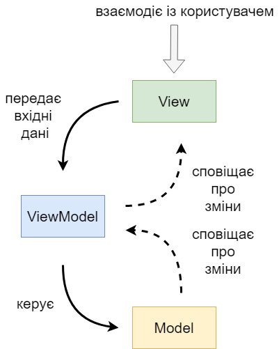
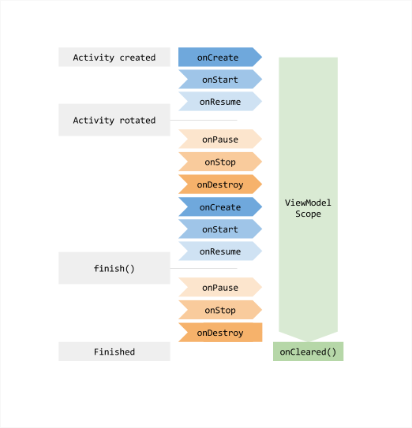

# MVVM, ViewModel та LiveData: Вирішення проблем екрану

Ласкаво просимо до розділу архітектури Android! У цьому туторіалі ми розберемо, як будувати сучасні та надійні Android-застосунки за допомогою паттерну **MVVM (Model-View-ViewModel)** та двох ключових компонентів Jetpack: **ViewModel** та **LiveData**.

---

## 1. Постановка проблеми: Простий таймер та поворот екрану

Уявіть, що ми розробляємо простий застосунок "Таймер". Інтерфейс складається з одного `TextView` (для показу залишкового часу) та кнопки "Запустити".

> 📦 **Початковий проект:**
> Ви можете завантажити або склонувати заготовку цього проекту з GitHub за посиланням: [krenevych/MVVM](https://github.com/krenevych/MVVM).

Припустимо, ми використали стандартний Android-клас `CountDownTimer` і написали логіку прямо всередині `MainActivity`:

```kotlin
class MainActivity : AppCompatActivity() {

    private lateinit var binding: ActivityMainBinding
    private var countDownTimer: CountDownTimer? = null

    override fun onCreate(savedInstanceState: Bundle?) {
        super.onCreate(savedInstanceState)
        binding = ActivityMainBinding.inflate(layoutInflater)
        setContentView(binding.root)

        binding.btnStart.setOnClickListener {
            startTimer()
        }
    }

    private fun startTimer() {
        // Запускаємо зворотний відлік на 30 секунд з інтервалом в 1 секунду (1000 мс)
        countDownTimer = object : CountDownTimer(30000, 1000) {
            override fun onTick(millisUntilFinished: Long) {
                Log.d(TAG, "onTick: $millisUntilFinished")
                val secondsLeft = millisUntilFinished / 1000
                binding.tvTimer.text = "$secondsLeft seconds left"
            }

            override fun onFinish() {
                Log.d(TAG, "onFinish: Timer is over!")
                binding.tvTimer.text = "Timer is over!"
            }
        }.start()
    }
}
```

На перший погляд, все працює. Але що станеться, коли користувач запустив таймер і **перевернув телефон**?

### Помилка 1: Втрата стану (Reset даних)
Як ми вже знаємо з уроків про життєвий цикл, при повороті екрану Android повністю знищує поточну `MainActivity` та створює нову. 
Поточний таймер втрачається, а новий екран відкривається з початковим станом. Користувач бачить, що таймер скинувся.

### Помилка 2: Виток пам'яті та фонові "зомбі-таймери"
Анонімний об'єкт `object : CountDownTimer` усередині `MainActivity` неявно тримає посилання на **старий знищений екземпляр `MainActivity`** (через виклик `binding.tvTimer`). 
* Сміттєзбирач (GC) не може видалити стару `MainActivity` з пам'яті -> **Memory Leak**.
* Старий таймер продовжує тікати у фоні та намагається оновити `binding` уже знищеного екрану.
* Якщо користувач на новому екрані знову натисне "Запустити", паралельно почнуть працювати вже **два** таймери!

---

## 2. Паттерн MVVM (Model-View-ViewModel)

Для вирішення подібних проблем Google пропонує використовувати архітектурний паттерн **MVVM (Model-View-ViewModel)**.



**Головне правило MVVM:** 
`View` (Activity) відповідає **тільки** за відображення UI та відмальовку даних. Вона не повинна містити бізнес-логіки та обчислень. Уся логіка та збереження стану виносяться у `ViewModel`.

---

## 3. Клас Jetpack [`ViewModel`](https://developer.android.com/topic/libraries/architecture/viewmodel) та його життєвий цикл

[`ViewModel`](https://developer.android.com/topic/libraries/architecture/viewmodel) — це архітектурний компонент Android Jetpack, призначений для зберігання та управління UI-даними з урахуванням життєвого циклу. 

Головне призначення `ViewModel` — **гарантувати збереження стану екрану** (введених даних, статусів завантаження, таймерів) при перестворенні `Activity` під час зміни конфігурації (наприклад, при повороті екрану, зміні теми або мови пристрою).

### Життєвий цикл ViewModel
Головна фішка `ViewModel` полягає в тому, що його об'єкт **переживає зміни конфігурації** (поворот екрану, зміну мови пристрою тощо).



Життєвий цикл `ViewModel` має лише два ключових моменти:
* **Створення (Народження):** Відбувається при першому запиті від Activity. Для одноразової початкової ініціалізації використовується стандартний блок Kotlin **`init { ... }`** (або початкові значення властивостей).
* **Остаточне знищення (Смерть):** Відбувається тільки тоді, коли `Activity` закривається остаточно (користувач натиснув кнопку "Назад" або викликано метод `finish()`). В цей момент у `ViewModel` викликається єдиний метод її життєвого циклу — **`onCleared()`**, у якому потрібно зупинити фонові задачі та звільнити ресурси.

### Створення класу ViewModel

```kotlin
import androidx.lifecycle.ViewModel
import timber.log.Timber

class TimerViewModel : ViewModel() {

    // 1. Початкове значення зберігається у ViewModel і НЕ скидається при повороті!
    var secondsLeft: Int = 30

    // 2. Блок init виконується ЛИШЕ ОДИН РАЗ при першому створенні ViewModel
    init {
        Timber.d("TimerViewModel створено!")
    }

    // 3. Метод onCleared() викликається ЛИШЕ ОДИН РАЗ при остаточному закритті екрану
    override fun onCleared() {
        super.onCleared()
        Timber.d("TimerViewModel знищено остаточно!")
        // Тут зупиняємо всі фонові таймери/потоки
    }
}
```

### Доступ до ViewModel з Activity (через делегат by viewModels)

Для створення та отримання екземпляра `ViewModel` у Kotlin рекомендовано використовувати спеціальний делегат `by viewModels()`.

1. Додайте залежність у `build.gradle.kts` (необхідна для роботи делегата `by viewModels()`):
   ```kotlin
   implementation("androidx.activity:activity-ktx:1.9.0")
   ```

2. Отримайте `ViewModel` в `MainActivity`:
   ```kotlin
   class MainActivity : AppCompatActivity() {

       // Автоматично створює або повертає ІСНУЮЧИЙ ViewModel при повороті
       private val viewModel: TimerViewModel by viewModels()

       override fun onCreate(savedInstanceState: Bundle?) {
           super.onCreate(savedInstanceState)
           // ...
       }
   }
   ```

> ⚠️ **Важливо:** Ніколи не створюйте `ViewModel` через звичайний конструктор (`val vm = TimerViewModel()`)! Якщо ви створите його через конструктор, Android не зможе зберегти його при повороті екрану.

### Альтернативний спосіб: ViewModelProvider

У багатьох проектах чи прикладах коду ви можете зустріти створення `ViewModel` через класичний об'єкт `ViewModelProvider`:

```kotlin
class MainActivity : AppCompatActivity() {

    private lateinit var viewModel: TimerViewModel

    override fun onCreate(savedInstanceState: Bundle?) {
        super.onCreate(savedInstanceState)
        
        // Отримання ViewModel через ViewModelProvider
        viewModel = ViewModelProvider(this)[TimerViewModel::class.java]
    }
}
```

Обидва варіанти (`by viewModels()` та `ViewModelProvider(this)[...]`) виконують однакову роботу "під капотом", але використання делегата `by viewModels()` вважається сучаснішим і лаконічнішим стандартом.

---

## 4. `LiveData` — реактивний супутник ViewModel

Тепер у нас є `ViewModel`, який зберігає дані при повороті. Але як `Activity` дізнається, що значення таймера змінилося і його потрібно перемалювати на екрані?

Для цього використовується [`LiveData`](https://developer.android.com/reference/kotlin/androidx/lifecycle/LiveData) — клас для збереження даних, який підтримує паттерн **Observer (Спостерігач)** та є **Lifecycle-Aware (чутливим до життєвого циклу)**.

### Чому саме LiveData, а не звичайні змінні?
1. **Автоматичне оновлення UI:** `Activity` підписується на `LiveData`. Щойно значення змінюється, UI оновлюється автоматично.
2. **Відсутність Memory Leaks:** `LiveData` знає про життєвий цикл екрану. Вона **не надсилає оновлення**, якщо `Activity` знаходиться у фоні (`onStop`).
3. **Безпека від крашів:** Якщо `Activity` знищена, `LiveData` автоматично відписує її, тому ви не отримаєте `NullPointerException` чи краш при спробі оновити неіснуючий UI.

### Інкапсуляція (Encapsulation) LiveData
У реальних проектах дотримуються правила: `Activity` може **читати** дані з `LiveData`, але змінювати їх має **тільки `ViewModel`**.

Для цього використовують дві версії:
* `MutableLiveData` (змінна) — приватна всередині `ViewModel`.
* `LiveData` (тільки для читання) — публічна для `Activity`.

### Повний приклад: TimerViewModel + LiveData

```kotlin
import android.os.CountDownTimer
import androidx.lifecycle.LiveData
import androidx.lifecycle.MutableLiveData
import androidx.lifecycle.ViewModel

class TimerViewModel : ViewModel() {

    // Приватне значення, яке ми можемо змінювати у ViewModel
    private val _secondsLeft = MutableLiveData<Long>(30)
    
    // Публічне значення тільки для читання, на яке підписується Activity
    val secondsLeft: LiveData<Long> = _secondsLeft

    private var countDownTimer: CountDownTimer? = null

    fun startTimer() {
        if (countDownTimer != null) return // Запобігаємо повторному запуску

        // Запускаємо відлік на 30 секунд з інтервалом в 1 секунду
        countDownTimer = object : CountDownTimer(30000, 1000) {
            override fun onTick(millisUntilFinished: Long) {
                // Змінюємо значення LiveData
                _secondsLeft.value = millisUntilFinished / 1000
            }

            override fun onFinish() {
                _secondsLeft.value = 0
            }
        }.start()
    }

    override fun onCleared() {
        super.onCleared()
        // Обов'язково зупиняємо таймер при остаточному знищенні ViewModel
        countDownTimer?.cancel()
    }
}
```

### Підписка на LiveData у MainActivity

```kotlin
class MainActivity : AppCompatActivity() {

    private lateinit var binding: ActivityMainBinding
    private val viewModel: TimerViewModel by viewModels()

    override fun onCreate(savedInstanceState: Bundle?) {
        super.onCreate(savedInstanceState)
        binding = ActivityMainBinding.inflate(layoutInflater)
        setContentView(binding.root)

        binding.btnStart.setOnClickListener {
            viewModel.startTimer()
        }

        // ПІДПИСКА на зміни LiveData
        // Передаємо 'this' (LifecycleOwner), щоб LiveData автоматично стежила за станом екрану
        viewModel.secondsLeft.observe(this) { seconds ->
            binding.tvTimer.text = "Залишилось: $seconds сек"
        }
    }
}
```

---

## 5. Різниця між `setValue()` та `postValue()` у LiveData

Коли ви змінюєте значення у `MutableLiveData`, у вас є два методи:
* **`setValue(value)`** (або `.value = ...`) — використовується **ТІЛЬКИ у головному потоці (Main/UI Thread)**. Змінює значення миттєво.
* **`postValue(value)`** — використовується при роботі з **фонових потоків (Background Thread)**. Перенаправляє оновлення у головний потік для безпечної відмальовки UI.

---

## Підсумок

* **Проблема:** Перевертання екрану знищує `Activity` та скидає стан, а фонові задачі викликають витоки пам'яті.
* **MVVM:** Архітектурний паттерн, який розділяє UI (`View`) та бізнес-логіку/стан (`ViewModel`).
* **`ViewModel`:** Клас Jetpack, який живе довше за Activity (переживає поворот екрану) і знищується лише при повному закритті екрану (викликаючи `onCleared()`).
* **`LiveData`:** Реактивний контейнер даних, який є Lifecycle-Aware (не оновлює UI, якщо екран у фоні) і дозволяє Activity підписуватися на зміни через `observe(this) { ... }`.
* **`setValue()` vs `postValue()`:** `setValue` для Main Thread, `postValue` для фонових потоків.
