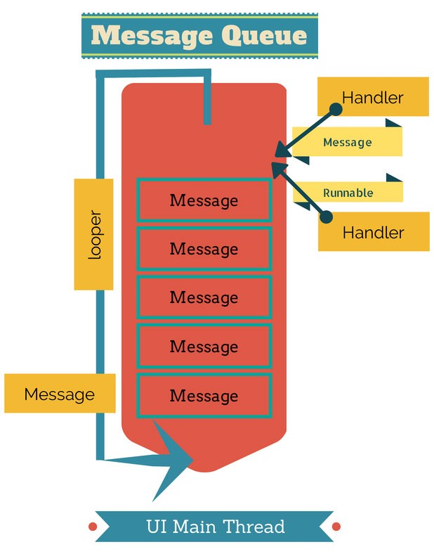

# Багатопоточність в Android: Threads, Looper та Handler

Ласкаво просимо до розділу багатопотоковості! У цьому туторіалі ми розглянемо класичні механізми роботи з потоками в Android, дізнаємося про головне правило UI-потоку та навчимося безпечно передавати дані між фоновими потоками й екраном за допомогою `Looper` та `Handler`.

---

## 1. Початковий проект та Правило Головного Потоку (Main/UI Thread)

> 📦 **Початковий проект:**
> Ви можете завантажити або склонувати заготовку цього проекту з GitHub за посиланням: [krenevych/Concurrency](https://github.com/krenevych/Concurrency) (гілка **`main`**, модуль **`threadshandler`**).

### Головний потік (Main Thread / UI Thread)
Коли Android-застосунок запускається, система створює один основний потік виконання — **Main Thread** (або UI Thread).

**Головний потік відповідає за два ключові завдання:**
1. Відмальовка графічного інтерфейсу (UI Views, кнопка, текст, анімації).
2. Обробка подій користувача (кліки, свайпи, введення з клавіатури).

### Золоті правила Android:
> ⚠️ **1. Не блокуйте Main Thread!** Якщо ви виконуєте важку операцію (завантаження з мережі, зчитування великого файлу, складні обчислення) у Main Thread, екран "замерзає", анімації гальмують, і через 5 секунд система показує помилку **ANR (Application Not Responding)**.
>
> ⚠️ **2. Оновлюйте UI тільки з Main Thread!** Якщо спробувати змінити текст у `TextView` чи колір кнопки безпосередньо з фонового потоку, застосунок одразу впаде з помилкою `CalledFromWrongThreadException`.

---

## 2. Класичний `Thread` та `CalledFromWrongThreadException`

Спробуємо виконати тривалу фонову задачу (наприклад, імітацію завантаження даних тривалістю 3 секунди) у фоновому потоці `Thread`:

```kotlin
class MainActivity : AppCompatActivity() {

    private lateinit var binding: ActivityMainBinding

    override fun onCreate(savedInstanceState: Bundle?) {
        super.onCreate(savedInstanceState)
        binding = ActivityMainBinding.inflate(layoutInflater)
        setContentView(binding.root)

        binding.btnLoadData.setOnClickListener {
            loadData()
        }
    }

    private fun loadData() {
        // Створюємо та запускаємо фоновий потік у лаконічному Kotlin-стилі
        thread {
            // Імітація важкої роботи у фоні (3 секунди)
            Thread.sleep(3000)

            // ПОМИЛКА! Спроба оновити UI прямо з фонового потоку
            binding.tvResult.text = "Дані завантажено!"
        }
    }
}
```

**Що станеться при запуску цього коду?**
Застосунок впаде із серйозною помилкою в Logcat:
`android.view.ViewRootImpl$CalledFromWrongThreadException: Only the original thread that created a view hierarchy can touch its views.`

Оскільки код усередині `thread { ... }` виконується на фоновому потоці, йому категорично заборонено торкатися елементів `ViewBinding` та UI.

---

## 3. Як влаштований зв'язок потоків: MessageQueue, Looper та Handler

Для того щоб фоновий потік міг безпечно передати результат виконання у головний UI-потік, в Android існує вбудований системний механізм, що складається з трьох компонентів:



### 1. `MessageQueue` (Черга повідомлень)
Це черга задач (повідомлень чи шматків коду `Runnable`), які чекають на своє виконання. У кожному потоці може бути своя `MessageQueue`.

### 2. `Looper` (Зациклений обробник)
`Looper` — це "нескінченний цикл", який прив'язаний до конкретного потоку. Він постійно перевіряє `MessageQueue`: як тільки у черзі з'являється нове повідомлення, `Looper` витягує його та передає на виконання у свій потік.
* Головний потік програми (`Looper.getMainLooper()`) має свій зациклений `Looper`, який працює протягом усього життя програми.

### 3. `Handler` (Міст передачі повідомлень)
`Handler` — це інструмент, через який ми можемо додавати нові задачі у `MessageQueue` конкретного потоку (наприклад, у чергу `Main Looper`'а) з будь-якого іншого фонового потоку.

---

## 4. Використання Handler для оновлення UI

Щоб виправити наведену вище помилку `CalledFromWrongThreadException`, створимо `Handler`, прив'язаний до `Looper.getMainLooper()`:

```kotlin
class MainActivity : AppCompatActivity() {

    private lateinit var binding: ActivityMainBinding
    
    // Створюємо Handler, прив'язаний до Головного потоку (Main Looper)
    private val mainHandler = Handler(Looper.getMainLooper())

    override fun onCreate(savedInstanceState: Bundle?) {
        super.onCreate(savedInstanceState)
        binding = ActivityMainBinding.inflate(layoutInflater)
        setContentView(binding.root)

        binding.btnLoadData.setOnClickListener {
            loadData()
        }
    }

    private fun loadData() {
        thread {
            // 1. Важка фонова робота (у фоновому потоці)
            Thread.sleep(3000)
            val loadedData = "Дані успішно завантажено!"

            // 2. Передаємо результат у Main Thread через Handler
            mainHandler.post {
                // Цей блок Runnable виконується ВЖЕ у Головному потоці!
                binding.tvResult.text = loadedData
            }
        }
    }
}
```

---

## 5. Передача результату у View через Callback-функції

У реальних застосунках функція завантаження даних `loadData()` не повинна напряму звертатися до елементів UI (`binding.tvResult.text`). Для чистоти коду та відокремлення логіки використовується **механізм колбеків (Callback)**.

1. Спочатку визначаємо функцію `loadData`, яка приймає лямбду-колбек `(String) -> Unit` та викликає її всередині `mainHandler.post`:

```kotlin
// 1. Функція завантаження даних приймає лямбду-колбек onResult
private fun loadData(onResult: (String) -> Unit) {
    thread {
        // Важка фонова робота (у фоновому потоці)
        Thread.sleep(3000)
        val loadedData = "Дані успішно завантажено!"

        // Повертаємо результат у Main Thread та викликаємо колбек
        mainHandler.post {
            onResult(loadedData)
        }
    }
}
```

> 💡 **Як читати запис `(String) -> Unit`?**
>
> Декларація `onResult: (String) -> Unit` описує **функціональний тип (лямбда-колбек)**:
> * **`(String)`** в дужках — це тип даних, який фоновий потік **передає назовні (у місце виклику)** при завершенні роботи (у нашому випадку — завантажений текст `loadedData`).
> * **`-> Unit`** — означає, що функція-обробник у `MainActivity` приймає цей рядок, але сама нічого назад не повертає (`Unit` в Kotlin — це аналог `void`).
>
> Коли фоновий потік викликає `onResult(loadedData)`, рядок `loadedData` потрапляє у змінну `result` всередині `MainActivity`.

2. А у `MainActivity` просто передаємо обробник результату під час натискання кнопки:

```kotlin
// 2. Викликаємо метод та передаємо колбек у MainActivity
binding.btnLoadData.setOnClickListener {
    loadData { result ->
        // Цей блок виконується у Main Thread — безпечно оновлюємо UI!
        binding.tvResult.text = result
    }
}
```

Завдяки цьому функція `loadData()` стає універсальною: вона не прив'язана до конкретного `TextView` і може виконувати будь-яку дію з отриманим результатом у місці виклику.

---

## 6. Відкладене виконання за допомогою `postDelayed()`

За допомогою `Handler` ви також можете виконувати задачі із затримкою за допомогою методу `postDelayed(runnable, delayMillis)`:

```kotlin
// Виконати код через 2 секунди (2000 мс) у Main Thread
mainHandler.postDelayed({
    binding.tvResult.text = "Минуло 2 секунди!"
}, 2000)
```

### Важливо: Видалення задач при `onDestroy()`
Якщо `Handler` має відкладені задачі `postDelayed()`, а користувач закрив `Activity` до їх виконання, ці задачі можуть викликати витік пам'яті (Memory Leak). Тому відкладені задачі потрібно скасовувати при знищенні екрану:

```kotlin
override fun onDestroy() {
    super.onDestroy()
    // Видаляємо всі незавершені колбеки та повідомлення для запобігання Memory Leak
    mainHandler.removeCallbacksAndMessages(null)
}
```

---

## 6. Альтернатива в Activity: `runOnUiThread()`

В Android-класі `Activity` є зручний скорочений метод `runOnUiThread { ... }`, який під капотом використовує той самий `Handler(Looper.getMainLooper())`:

```kotlin
thread {
    Thread.sleep(3000)
    
    // Скорочений спосіб передати роботу у Main Thread
    runOnUiThread {
        binding.tvResult.text = "Дані завантажено!"
    }
}
```

> 💡 **Готовий розв'язок:**
> Повний робочий код із використання `Handler` та колбеків можна переглянути в репозиторії [krenevych/Concurrency](https://github.com/krenevych/Concurrency) на гілці **`solution`** (модуль **`threadshandler`**).

---

## 7. Як додати Looper до власного фонового потоку (`Looper.prepare()` та `HandlerThread`)

За замовчуванням звичайні фонові потоки `thread { ... }` в Android **не мають** свого `Looper` та `MessageQueue`. Вони виконують свій блок коду один раз і одразу завершуються.

Якщо ви спробуєте створити `Handler()` усередині звичайного фонового потоку, застосунок впаде з помилкою:
`java.lang.RuntimeException: Can't create handler inside thread Thread[...] that has not called Looper.prepare()`

### 1. Ручне створення Looper (`Looper.prepare()` + `Looper.loop()`)

Щоб перетворити фоновий потік на "постійний робочий потік", який здатен приймати нові задачі через свій `Handler`, необхідно вручну підготувати для нього `Looper`:

```kotlin
thread {
    // 1. Створюємо MessageQueue та Looper для цього фонового потоку
    Looper.prepare()

    // 2. Створюємо Handler, прив'язаний до поточного фонового потоку
    val backgroundHandler = Handler(Looper.myLooper()!!)

    // 3. Запускаємо нескінченний цикл обробки повідомлень
    Looper.loop()
}
```

* **`Looper.prepare()`** — створює чергу `MessageQueue` та зв'язує новий `Looper` з поточним фоновим потоком.
* **`Looper.myLooper()`** — повертає `Looper`, який належить цьому фоновому потоку.
* **`Looper.loop()`** — запускає нескінченний цикл обробки задач. Потік працюватиме і чекатиме на нові задачі, поки ви не викличете `looper.quit()`.

---

### 2. Зручна альтернатива від Android: `HandlerThread`

Щоб не налаштовувати `Looper.prepare()` та `Looper.loop()` вручну, в Android є готовий спеціалізований клас [`HandlerThread`](https://developer.android.com/reference/android/os/HandlerThread) — це клас `Thread`, який уже має вбудований та готовий до роботи `Looper`.

```kotlin
class MainActivity : AppCompatActivity() {

    private lateinit var handlerThread: HandlerThread
    private lateinit var backgroundHandler: Handler

    override fun onCreate(savedInstanceState: Bundle?) {
        super.onCreate(savedInstanceState)
        
        // 1. Створюємо та запускаємо HandlerThread
        handlerThread = HandlerThread("MyBackgroundWorker").apply { start() }

        // 2. Передаємо looper фонового потоку у новий Handler
        backgroundHandler = Handler(handlerThread.looper)
    }

    private fun doWorkInBackground() {
        // 3. Надсилаємо задачу на виконання у фоновий потік
        backgroundHandler.post {
            // Цей блок виконується у фоновому потоці "MyBackgroundWorker"
            Thread.sleep(2000)
        }
    }

    override fun onDestroy() {
        super.onDestroy()
        // 4. Обов'язково зупиняємо фоновий потік при закритті екрану!
        handlerThread.quitSafely()
    }
}
```

---

## 8. Проблеми та недоліки класичного підходу (Threads + Handler)

Хоча `Thread`, `Handler` та `Looper` є фундаментом Android, у сучасній розробці писати код безпосередньо через ці низькорівневі інструменти вважається застарілим та небезпечним підходом.

Ось головні проблеми класичної багатопотоковості:

### 1. "Спагеті-код" та Callback Hell (Пекло колбеків)
Коли одна фонова задача залежить від результату іншої (наприклад: *завантажити профіль* ➔ *потім завантажити аватарку* ➔ *потім обробити зображення*), код швидко перетворюється на заплутаний ланцюжок вкладених потоків та колбеків, у якому дуже легко заплутатися.

### 2. Витоки пам'яті (Memory Leaks)
Якщо фоновий потік `Thread` або відкладений `Handler.postDelayed()` продовжує працювати після того, як користувач перевернув чи закрив екран, він неявно тримає посилання на знищену `Activity` або її `ViewBinding`. В результаті сміттєзбирач (GC) не може очистити пам'ять.

### 3. Ігнорування життєвого циклу (Lifecycle Unawareness)
Ані `Thread`, ані `Handler` **не знають нічого про життєвий цикл** екрану. Якщо результат роботи з мережі чи бази даних приходить у момент, коли `Activity` знаходиться у фоні (`onStop`) або знищена, це призводить до крашів чи марної витрати ресурсів.

### 4. Складність обробки помилок (Exception Handling)
Виняток (`Exception`), який виник усередині фонового потоку `thread { ... }`, **неможливо перехопити** звичайним блоком `try-catch` у головному потоці. Якщо у фоновому потоці станеться помилка, застосунок миттєво впаде.

### 5. Важкість системних потоків (Resource Overhead)
Кожен екземпляр `Thread` в Android — це справжній "важковаговий" потік операційної системи Linux, який споживає значний обсяг оперативної пам'яті (близько 1 МБ на потік) та ресурсів процесора.

---

> 💡 **Сучасне рішення:** 
> Для вирішення всіх цих проблем розробники Kotlin створили **Корутини (Kotlin Coroutines)** — легку, зручну та Lifecycle-Aware асинхронну модель, яку ми розберемо у наступних уроках!

---

## Підсумок

* **Main Thread (UI Thread)** відповідає за відмальовку UI та обробку подій. Його не можна блокувати важкими операціями.
* **`CalledFromWrongThreadException`** виникає, коли фоновий потік намагається змінити елементи `View`.
* **`Looper`** — це нескінченний цикл, який перевіряє `MessageQueue` (чергу задач) конкретного потоку.
* **`Handler`** дозволяє з фонового потоку відправляти задачі (`Runnable`) у чергу головного потоку (`Looper.getMainLooper()`).
* **`Looper.prepare()` + `Looper.loop()`** дозволяють створити власний `Looper` та `Handler` на фоновому потоці.
* **`HandlerThread`** — готовий клас Android, який об'єднує `Thread` та `Looper` для зручного виконання фонових задач.
* **`postDelayed()`** використовується для відкладеного виконання задач, а `removeCallbacksAndMessages(null)` чи `quitSafely()` — для запобігання витокам пам'яті.
